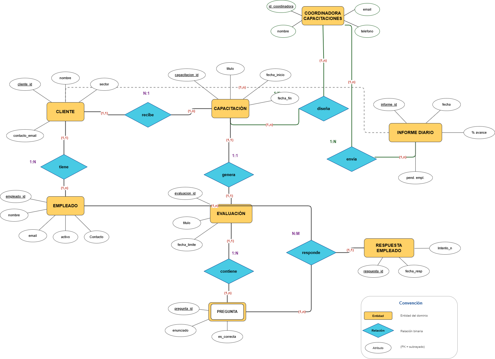

# 📄 Informe Técnico del Taller

## 🔖 Nombre del Taller
Taller 2: Modelo de Información y Diagrama de Contexto
## 👥 Integrantes del equipo
- Andrea Sosa - AndreSosa21
- Juan Gomez - juangomepere
- Samuel Rodriguez - sam200630

## 🧠 Descripción general del trabajo
El objetivo del taller fue realizar el modelo Entidad–Relación (ER) de la empresa Suporta S.A.S, representando de manera estructurada la información involucrada en el proceso de gestión de capacitaciones virtuales. El propósito principal fue identificar las entidades del dominio, sus atributos, claves primarias y las relaciones existentes entre ellas, definiendo correctamente sus cardinalidades.

La actividad consistió en analizar el funcionamiento actual de la empresa, comprender cómo se relacionan clientes, empleados, capacitaciones y evaluaciones, y traducir esa lógica de negocio a un modelo conceptual utilizando la notación ER. El resultado final es un diagrama realizado en drawio que refleja la estructura de datos necesaria para soportar el proceso organizacional descrito.
## 🔧 Proceso de desarrollo
El desarrollo inició con la identificación de las entidades principales del negocio: Cliente, Empleado y Capacitación. Posteriormente se modelaron los elementos académicos: Evaluación y Pregunta.

Se establecieron las relaciones principales:

- Un cliente tiene empleados.

- Un cliente recibe una capacitación general.

- Una capacitación genera una evaluación.

- Una evaluación contiene múltiples preguntas.

- Un empleado responde preguntas.

- Una coordinadora diseña la capacitación general.

- La coordinadora envía informes diarios a cada clientes.

Durante el proceso se definieron las cardinalidades (1:1, 1:N, N:M) según las reglas del negocio. Se decidió modelar la relación “responde” como N:M entre Empleado y Evaluación, soportada por la entidad Respuesta_Empleado, que permite registrar intentos y fechas de respuesta. (FALTA ACTUALIZAR EN DIAGRAMA)

## 🧩 Análisis del modelo propuesto
Cómo se estructura el modelo entregado

El modelo se divide en tres bloques principales:

**Estructura organizacional**

- CLIENTE

- EMPLEADO

- COORDINADORA_CAPACITACIONES

- Representa los actores involucrados en el proceso.

**Estructura académica**

- CAPACITACION

- EVALUACION

- PREGUNTA

Modela el contenido formativo y su estructura jerárquica.

**Seguimiento y control**

- RESPUESTA_EMPLEADO

- INFORME_DIARIO

Permite registrar el desempeño individual y generar reportes de avance.

La relación N:M entre EMPLEADO y EVALUACION se materializa mediante RESPUESTA_EMPLEADO, que almacena el intento, la respuesta dada, si es correcta y la fecha.

**Cómo representa las necesidades del cliente**

El modelo permite:

- Asociar empleados a una empresa específica.

- Asignar capacitaciones a múltiples clientes.

- Vincular cada capacitación con una evaluación.

- Controlar las preguntas que componen cada evaluación.

- Registrar intentos múltiples por empleado.

- Identificar si las respuestas fueron correctas.

- Generar informes diarios con porcentaje de avance y empleados pendientes.

Esto permite automatizar el proceso que actualmente se realiza manualmente mediante formularios y hojas de cálculo.
## 📈 Diagrama final entregado
> 

## 📋 Tabla de actores, entidades o componentes (si aplica)

| Nombre del elemento     | Tipo       | Descripción                                                                 | Responsable |
|--------------------------|------------|------------------------------------------------------------------------------|-------------|
| Cliente                  | Entidad    | Organización o empresa que utiliza la plataforma para gestionar empleados. | Cliente     |
| Empleado                 | Entidad    | Persona vinculada a la empresa (cliente) que recibe capacitaciones y realiza evaluaciones. | Cliente     |
| Capacitación             | Entidad    | Contenido formativo asignado a empleados.                       | Cliente     |
| Evaluación               | Entidad    | Instrumento de medición asociado a una capacitación.
| Coordinadora capacitación               | Entidad    | Persona encargada de gestionar y crear la capacitación
| Cliente     |
| Pregunta                 | Entidad    | Ítem individual que compone una evaluación.                                 | Cliente     |
| Respuesta Empleado       | Entidad    | Registro de la respuesta dada por un empleado a una pregunta.               | Empleado    |
| Informe Diario           | Entidad    | Reporte generado sobre el  desempeño del empleado.                | Sistema     |

## 🔍 Investigación complementaria
### Tema investigado:

Buenas prácticas en modelado Entidad–Relación y manejo de relaciones N:M.

### Resumen:

En el modelado ER, las relaciones muchos-a-muchos deben analizarse cuidadosamente, ya que en su implementación relacional requieren una entidad intermedia que permita almacenar atributos adicionales y garantizar integridad referencial. Según Silberschatz, Korth & Sudarshan (Database System Concepts), este enfoque mejora la normalización y evita redundancia de datos.

Asimismo, la correcta definición de cardinalidades mínimas y máximas es fundamental para representar fielmente las reglas del negocio. Una mala definición puede generar restricciones incorrectas en la base de datos o inconsistencias lógicas en el sistema.

En este taller, estas buenas prácticas se aplicaron especialmente en la relación entre Empleado y Evaluación, donde se incorporó la entidad Respuesta_Empleado para almacenar intentos y resultados.

## 📚 Referencias
- [1] Silberschatz, Abraham; Korth, Henry F.; Sudarshan, S. Database System Concepts. 7th ed. McGraw-Hill Education, 2019.

- [2] Elmasri, Ramez; Navathe, Shamkant B. Fundamentals of Database Systems. 7th ed. Pearson, 2016.

---

_Este documento hace parte de la entrega del taller X del curso AREM (Arquitectura Empresarial) - Universidad de La Sabana._
